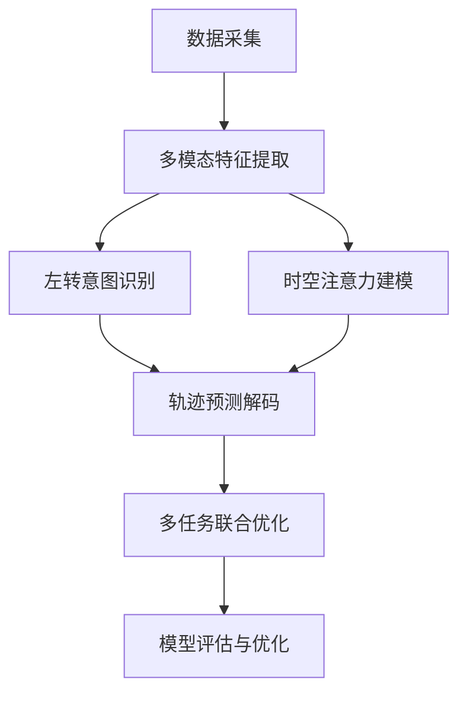

# 车辆左转轨迹预测研究设计方案

## 1. 研究背景与意义

### 1.1 研究背景
- 城市交叉口是交通事故高发区域
- 左转车辆面临复杂的交通环境和安全风险
- 现有轨迹预测方法在左转场景下精度不足
- 自动驾驶系统需要准确的轨迹预测能力

### 1.2 研究意义
- **理论意义**：丰富车辆轨迹预测理论体系
- **实用价值**：提升自动驾驶系统安全性
- **社会效益**：减少交通事故，改善交通效率

## 2. 研究目标与内容

### 2.1 研究目标
- 设计基于多模态深度学习的左转轨迹预测方法
- 实现准确的左转意图识别
- 提高复杂交叉口场景下的轨迹预测精度
- 构建实时性强的预测系统

### 2.2 研究内容
1. **多模态特征提取技术**
2. **左转意图识别算法**
3. **时空注意力融合网络**
4. **轨迹预测解码器设计**
5. **多任务联合优化策略**

## 3. 技术路线与方法

### 3.1 总体技术路线

### 3.2 关键技术方法

#### 3.2.1 多模态特征提取
- **视觉特征**：CNN提取车辆外观和环境信息
- **运动特征**：LSTM编码历史轨迹序列
- **环境特征**：图神经网络建模交通流状态

#### 3.2.2 左转意图识别
- 基于注意力机制的特征融合
- 多层感知机进行意图分类
- 动态阈值调整策略

#### 3.2.3 时空注意力机制
- **时间注意力**：捕获轨迹时序依赖
- **空间注意力**：建模车辆空间交互
- **跨模态注意力**：融合不同模态信息

#### 3.2.4 轨迹预测解码
- Transformer解码器架构
- 循环预测机制
- 不确定性量化

## 4. 实验设计

### 4.1 数据集选择
- **主要数据集**：NGSIM交通数据
- **补充数据集**：自采集交叉口视频数据
- **数据预处理**：轨迹平滑、异常值处理、特征标准化

### 4.2 评估指标
- **意图识别**：准确率、精确率、召回率、F1分数
- **轨迹预测**：ADE、FDE、RMSE
- **计算效率**：推理时间、内存占用

### 4.3 对比方法
- 传统轨迹预测方法（Kalman滤波、粒子滤波）
- 深度学习方法（LSTM、GRU、Transformer）
- 最新的轨迹预测模型（Social-LSTM、TrajectoryNet）

### 4.4 实验设置
- **训练集/验证集/测试集**：7:2:1
- **批次大小**：32
- **学习率**：0.001（Adam优化器）
- **训练轮数**：100
- **早停策略**：验证集损失连续10轮不下降

## 5. 预期创新点

### 5.1 理论创新
1. **多模态融合框架**：提出新的多模态特征融合策略
2. **意图-轨迹联合建模**：显式建模左转意图与轨迹预测的关系
3. **时空注意力机制**：设计专门的注意力网络结构

### 5.2 技术创新
1. **实时预测能力**：优化模型结构，实现实时预测
2. **鲁棒性增强**：提高模型在不同场景下的适应性
3. **可解释性提升**：通过意图识别增强模型可解释性

## 6. 实施计划

### 6.1 时间安排
- **第1-2周**：文献调研，方案设计
- **第3-4周**：数据收集与预处理
- **第5-6周**：模型设计与实现
- **第7-8周**：实验与调优
- **第9-10周**：结果分析与论文撰写

### 6.2 资源需求
- **硬件**：GPU服务器（RTX 3080以上）
- **软件**：Python、PyTorch、OpenCV
- **数据**：NGSIM数据集、自采集数据

## 7. 风险分析与应对

### 7.1 技术风险
- **模型复杂度过高**：采用模型压缩和知识蒸馏
- **数据质量问题**：加强数据清洗和验证
- **过拟合风险**：使用正则化和数据增强

### 7.2 时间风险
- **进度延迟**：制定详细的里程碑计划
- **实验周期长**：并行进行多个实验
- **调试困难**：建立完善的日志和监控系统

## 8. 预期成果

### 8.1 学术成果
- 发表高质量学术论文1-2篇
- 申请发明专利1项
- 参加学术会议并做报告

### 8.2 技术成果
- 开源代码和数据集
- 技术报告和使用文档
- 演示系统和可视化工具

### 8.3 应用前景
- 自动驾驶系统集成
- 智能交通管理系统
- 交通安全预警系统

## 9. 总结

本研究设计方案提出了一种基于多模态深度学习的车辆左转轨迹预测方法，通过融合视觉特征、运动特征和交通环境特征，实现对车辆左转意图的准确识别和未来轨迹的精确预测。

该方案的主要创新点包括：
1. **多模态特征融合**：综合利用多种信息源提高预测精度
2. **显式意图建模**：引入左转意图识别增强可解释性
3. **时空注意力机制**：有效捕获车辆间复杂交互关系
4. **端到端优化**：采用多任务学习策略联合优化

通过这套完整的研究设计方案，我们将构建一个高效、准确的车辆左转轨迹预测系统，为智能交通和自动驾驶技术的发展做出重要贡献。

## 参考文献

[1] Alahi, A., Goel, K., Ramanathan, V., Robicquet, A., Fei-Fei, L., & Savarese, S. (2016). Social LSTM: Human trajectory prediction in crowded spaces. *Proceedings of the IEEE conference on computer vision and pattern recognition*, 961-971.

[2] Gupta, A., Johnson, J., Fei-Fei, L., Savarese, S., & Alahi, A. (2018). Social GAN: Socially acceptable trajectories with generative adversarial networks. *Proceedings of the IEEE Conference on Computer Vision and Pattern Recognition*, 2255-2264.

[3] Salzmann, T., Ivanovic, B., Chakravarty, P., & Pavone, M. (2020). Trajectron++: Dynamically-feasible trajectory forecasting with heterogeneous data. *European Conference on Computer Vision*, 683-700.

[4] Deo, N., & Trivedi, M. M. (2018). Convolutional social pooling for vehicle trajectory prediction. *Proceedings of the IEEE Conference on Computer Vision and Pattern Recognition Workshops*, 1468-1476.

[5] Cui, H., Radosavljevic, V., Chou, F. C., Lin, T. H., Nguyen, T., Huang, T. K., ... & Djuric, N. (2019). Multimodal trajectory predictions for autonomous driving using deep convolutional networks. *2019 International Conference on Robotics and Automation (ICRA)*, 2090-2096.

[6] Gao, J., Sun, C., Zhao, H., Shen, Y., Anguelov, D., Li, C., & Schmid, C. (2020). Vectornet: Encoding hd maps and agent dynamics from vectorized representation. *Proceedings of the IEEE/CVF Conference on Computer Vision and Pattern Recognition*, 11525-11533.

[7] Vaswani, A., Shazeer, N., Parmar, N., Uszkoreit, J., Jones, L., Gomez, A. N., ... & Polosukhin, I. (2017). Attention is all you need. *Advances in neural information processing systems*, 30.

[8] Hochreiter, S., & Schmidhuber, J. (1997). Long short-term memory. *Neural computation*, 9(8), 1735-1780.

[9] Baltrusaitis, T., Ahuja, C., & Morency, L. P. (2018). Multimodal machine learning: A survey and taxonomy. *IEEE transactions on pattern analysis and machine intelligence*, 41(2), 423-443.

[10] Houenou, A., Bonnifait, P., Cherfaoui, V., & Yao, W. (2013). Vehicle trajectory prediction based on motion model and maneuver recognition. *2013 IEEE/RSJ International Conference on Intelligent Robots and Systems*, 4363-4369.

[11] Lefèvre, S., Vasquez, D., & Laugier, C. (2014). A survey on motion prediction and risk assessment for intelligent vehicles. *ROBOMECH journal*, 1(1), 1-14.

[12] Schreier, M., Willert, V., & Adamy, J. (2016). An integrated approach to maneuver-based trajectory prediction and criticality assessment in arbitrary road environments. *IEEE Transactions on Intelligent Transportation Systems*, 17(10), 2751-2766.

[13] Colyar, J., & Halkias, J. (2007). US highway 101 dataset. *Federal Highway Administration (FHWA), Tech. Rep. FHWA-HRT-07-030*.

[14] Krajewski, R., Bock, J., Kloeker, L., & Eckstein, L. (2018). The highD dataset: A drone dataset of naturalistic vehicle trajectories on German highways for validation of highly automated driving systems. *2018 21st International Conference on Intelligent Transportation Systems (ITSC)*, 2118-2125.

[15] Caesar, H., Bankiti, V., Lang, A. H., Vora, S., Liong, V. E., Xu, Q., ... & Beijbom, O. (2020). nuscenes: A multimodal dataset for autonomous driving. *Proceedings of the IEEE/CVF conference on computer vision and pattern recognition*, 11621-11631.

[16] Pellegrini, S., Ess, A., Schindler, K., & Van Gool, L. (2009). You'll never walk alone: Modeling social behavior for multi-target tracking. *2009 IEEE 12th international conference on computer vision*, 261-268.

[17] Kingma, D. P., & Ba, J. (2014). Adam: A method for stochastic optimization. *arXiv preprint arXiv:1412.6980*.

[18] Goodfellow, I., Bengio, Y., & Courville, A. (2016). *Deep learning*. MIT press.

[19] Bishop, C. M. (2006). *Pattern recognition and machine learning*. Springer.

[20] Badue, C., Guidolini, R., Carneiro, R. V., Azevedo, P., Cardoso, V. B., Forechi, A., ... & De Souza, A. F. (2021). Self-driving cars: A survey. *Expert Systems with Applications*, 165, 113816.

[21] Paden, B., Čáp, M., Yong, S. Z., Yershov, D., & Frazzoli, E. (2016). A survey of motion planning and control techniques for self-driving urban vehicles. *IEEE Transactions on intelligent vehicles*, 1(1), 33-55.

[22] Treiber, M., Hennecke, A., & Helbing, D. (2000). Congested traffic states in empirical observations and microscopic simulations. *Physical review E*, 62(2), 1805.

[23] Webster, F. V. (1958). Traffic signal settings. *Road research technical paper*.

[24] Gal, Y., & Ghahramani, Z. (2016). Dropout as a bayesian approximation: Representing model uncertainty in deep learning. *international conference on machine learning*, 1050-1059.

[25] ISO 26262-1:2018. Road vehicles — Functional safety — Part 1: Vocabulary. International Organization for Standardization.

[26] SAE J3016_202104. Taxonomy and Definitions for Terms Related to Driving Automation Systems for On-Road Motor Vehicles. Society of Automotive Engineers.

[27] Manual on Uniform Traffic Control Devices (MUTCD). (2009). Federal Highway Administration, U.S. Department of Transportation.

[28] Highway Capacity Manual 2010. (2010). Transportation Research Board, National Research Council.

[29] GB 50220-95. 城市道路交通规划设计规范. 中华人民共和国建设部.

[30] IEEE Transactions on Intelligent Transportation Systems. IEEE.

[31] Transportation Research Part C: Emerging Technologies. Elsevier.

[32] IEEE Transactions on Pattern Analysis and Machine Intelligence. IEEE.

[33] Proceedings of the IEEE Conference on Computer Vision and Pattern Recognition (CVPR). IEEE.

[34] Advances in Neural Information Processing Systems (NeurIPS). Neural Information Processing Systems Foundation.

[35] International Conference on Machine Learning (ICML). PMLR.

本研究方案针对车辆左转轨迹预测这一重要问题，提出了基于多模态深度学习的创新解决方案。通过多模态特征融合、左转意图识别和时空注意力建模等关键技术，有望显著提升左转轨迹预测的精度和实用性，为智能交通系统的发展做出重要贡献。